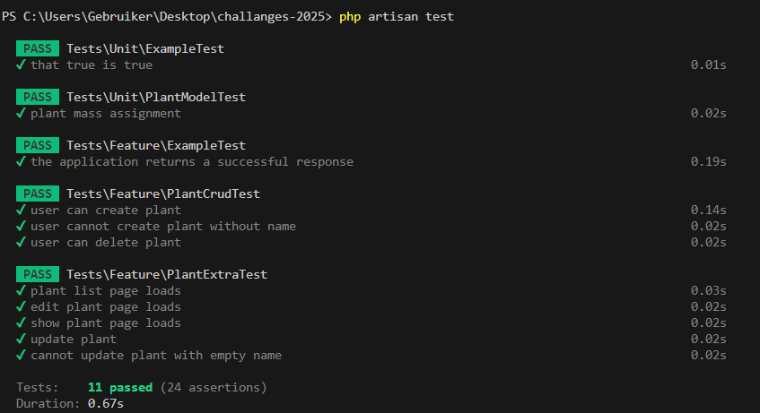

# Test Plan, Results, and Evaluation (Simple Version)

## What are we testing?

I want to check if adding and deleting plants works, and if the app stops us from doing something wrong (like leaving the name empty).

## User Stories (What should happen)

1. As a user I want to add a plant so that I can remember it.
- If I fill in the form right, the plant shows up in the list. (Happy path)
- If I forget the name, I get an error. (Unhappy path)

2. As a user I want to delete a plant so that if I don't want it anymore I can have it gone.
- If I click delete, the plant is gone. (Happy path)
- If I try to delete a plant that doesn't exist, nothing happens. (Unhappy path)

## System Tests:

- User Story 1 (V-model):
- Happy path: Add a plant with all info filled in 
- Unhappy path: Try to add a plant with no name 

- User Story 2 (V-model):
- Happy path: Delete a plant 
- Unhappy path: Try to delete a plant that doesn't exist

- Extra Tests (not V-model):
- List page loads 
- Edit page loads 
- Show page loads 
- Update plant 
- Cannot update plant with empty name 

## Unit Tests

- User Story 1 (V-model):
- Check if the Plant model saves the information right (test_plant_mass_assignment)

- User Story 2:
- (Could add: test that deleting a Plant instance removes it from the database)

## What did the tests look like?

- Add plant: test_user_can_create_plant
- No name: test_user_cannot_create_plant_without_name 
- Delete: test_user_can_delete_plant 
- Model: test_plant_mass_assignment 
- List page: test_plant_list_page_loads 
- Edit page: test_edit_plant_page_loads 
- Show page: test_show_plant_page_loads 
- Update: test_update_plant
- Empty name: test_cannot_update_plant_with_empty_name (not V-model)

## Test Results

## What can the tests catch?
- If I forget to fill in the name, I get an error
- If I add or delete a plant, it really happens in the database

## What can the tests NOT catch?
- If the page looks weird or buttons are missing
- If the database is broken

## Does everything work?

The main stuff (add/delete plants, form errors) works because the tests say so. But there could still be problems I didn't test, like weird edge cases or security stuff. So, it works for the basics!